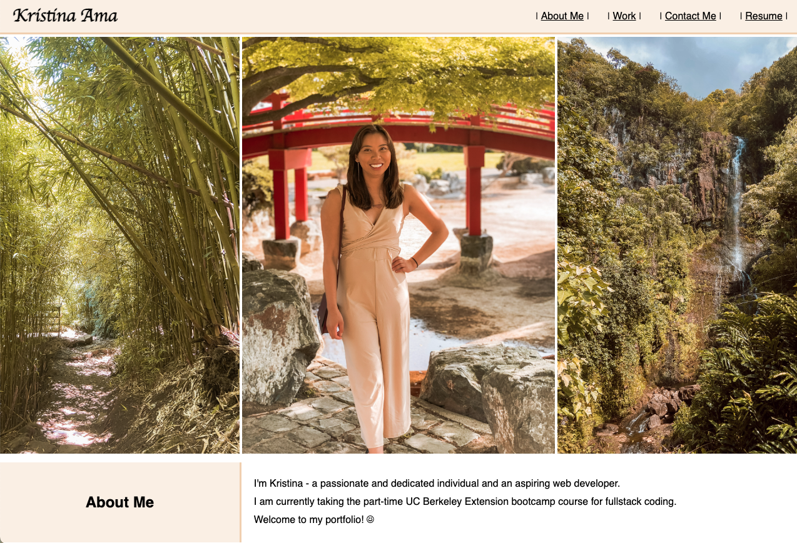

# Homework-02

## Description

This portfolio is meant to showcase my software development skills. I aim to share this portfolio for public viewing of my projects.

## Installation

The HTML code and CSS code can be downloaded via the Homework-02 folder on my Github page. It can also be viewed by visiting the following URL:
https://kristinaama.github.io/Homework-02/

## Usage

This portfolio is intended for easy viewing and navigation of my deployed projects.
The navigation bar includes sections to information about me, my projects, my contact information, and my resume.

## License

Please refer to the attached MIT License.
